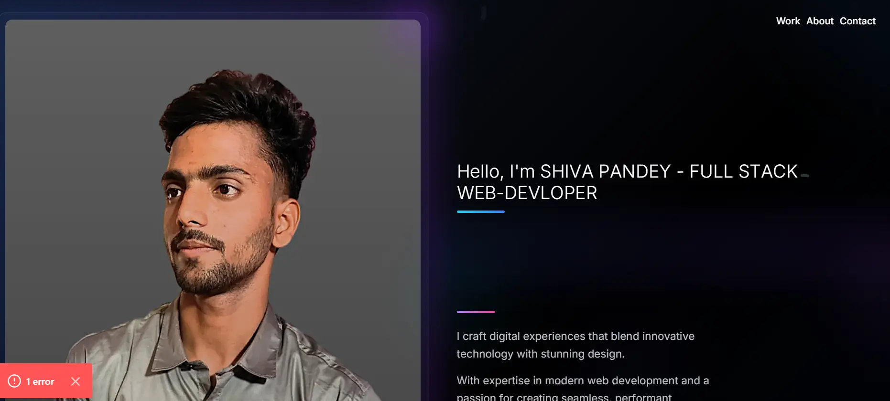

<div align="center">

# ✨ Portfolio V2

### A Modern, Interactive Developer Portfolio

<p align="center">
  
  
  
  
  
</p>

<p align="center">
  <a href="https://your-portfolio-url.vercel.app">🌐 Live Demo</a> •
  <a href="#-features">Features</a> •
  <a href="#-tech-stack">Tech Stack</a> •
  <a href="#-getting-started">Get Started</a>
</p>

<br />



</div>

---

## 🎯 Overview

A cutting-edge portfolio website featuring an **interactive macOS-style interface** with working apps, smooth animations, and a premium dark aesthetic. Built with the latest web technologies to showcase projects, skills, and personality in a unique way.

## ⚡ Features

<table>
<tr>
<td>

### 🖥️ Interactive macOS Experience
- Fully functional **MacBook interface**
- Draggable windows with realistic behavior
- Working dock with app icons
- Menu bar with live clock

</td>
<td>

### 🎵 Built-in Music Player
- YouTube-based music streaming
- 10 pre-loaded default songs
- Custom playlist management
- Spotify-inspired UI

</td>
</tr>
<tr>
<td>

### 🎮 Mini Games Arcade
- Snake, Pong, Breakout
- Tic-Tac-Toe, Memory
- Minesweeper & more
- Retro arcade vibes

</td>
<td>

### 💻 Terminal Emulator
- Interactive terminal app
- Custom commands
- Developer Easter eggs
- Authentic macOS feel

</td>
</tr>
</table>

### More Features

- 🎨 **Stunning Animations** - GSAP & Framer Motion powered transitions
- 🌙 **Dark Theme** - Premium dark aesthetic with subtle gradients
- 📱 **Responsive Design** - Works beautifully on all devices
- ⚡ **Lightning Fast** - Optimized Next.js 15 with Turbopack
- 🔄 **Smooth Scrolling** - Buttery smooth scroll animations
- 📅 **Cal.com Integration** - Easy meeting scheduling
- 🎯 **Project Showcase** - Beautiful project cards with hover effects
- 💼 **Skills Display** - Animated skill icons and categories

## 🛠️ Tech Stack

<div align="center">

| Category | Technologies |
|----------|-------------|
| **Framework** | Next.js 15, React 19, TypeScript |
| **Styling** | Tailwind CSS 4, SCSS Modules |
| **Animation** | GSAP, Framer Motion |
| **Icons** | Lucide React, React Icons |
| **UI Components** | Custom Components, Sonner (Toasts) |
| **Deployment** | Vercel |

</div>

## 📁 Project Structure

```
portfolio-v2/
├── app/                    # Next.js App Router
│   ├── layout.tsx         # Root layout
│   ├── page.tsx           # Home page
│   └── os/                # macOS interface route
├── Components/
│   ├── landing/           # Landing page components
│   │   ├── Hero.tsx       # Main hero section
│   │   └── Preloader.tsx  # Loading animation
│   ├── ui/                # UI sections
│   │   ├── About.tsx      # About section
│   │   ├── Contact.tsx    # Contact section
│   │   ├── Project.tsx    # Projects showcase
│   │   └── Skill.tsx      # Skills display
│   └── UI-comps/
│       └── Macbook/       # 💻 macOS Interface
│           ├── Apps/      # Built-in applications
│           │   ├── Music/     # 🎵 Music Player
│           │   ├── Games/     # 🎮 Mini Games
│           │   └── Terminal/  # 💻 Terminal
│           ├── components/    # Window, Dock, Menubar
│           └── hooks/         # Custom React hooks
└── public/
    └── Images/            # Static assets
```

## 🚀 Getting Started

### Prerequisites

- Node.js 18+ 
- npm / yarn / pnpm / bun

### Installation

```bash
# Clone the repository
git clone https://github.com/SHIWA6/Portfolio-V2.git

# Navigate to project
cd Portfolio-V2

# Install dependencies
npm install

# Start development server
npm run dev
```

Open [http://localhost:3000](http://localhost:3000) to see the magic! ✨

### Build for Production

```bash
# Create optimized build
npm run build

# Start production server
npm start
```

## 🎨 Customization

### Adding Default Songs (Music Player)

Edit `Components/UI-comps/Macbook/Apps/Music/data/defaultSongs.ts`:

```typescript
export const defaultYouTubeUrls: string[] = [
  'https://www.youtube.com/watch?v=YOUR_VIDEO_ID',
  // Add more songs...
];
```

### Adding Projects

Update your project data in the Projects component with:
- Project title & description
- Tech stack used
- Live demo & GitHub links
- Preview images

## 📱 Screenshots

<div align="center">
<table>
<tr>
<td></td>
<td></td>
</tr>
<tr>
<td></td>
<td></td>
</tr>
</table>
</div>

## 🤝 Connect

<div align="center">

[](https://github.com/SHIWA6)
[](https://linkedin.com/in/your-profile)
[](https://twitter.com/your-handle)
[](https://your-portfolio-url.vercel.app)

</div>

## 📄 License

This project is open source and available under the [MIT License](LICENSE).

---

<div align="center">

### ⭐ Star this repo if you like it!

Made with 💜 and lots of ☕

</div>
